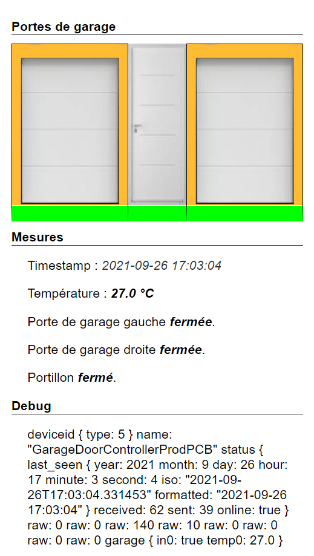
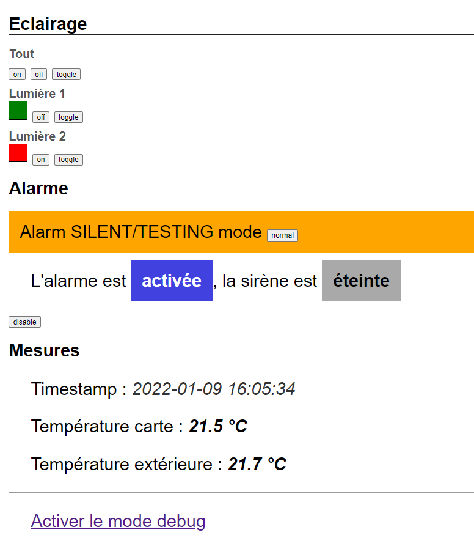
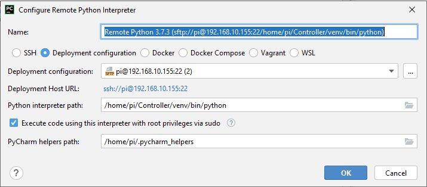
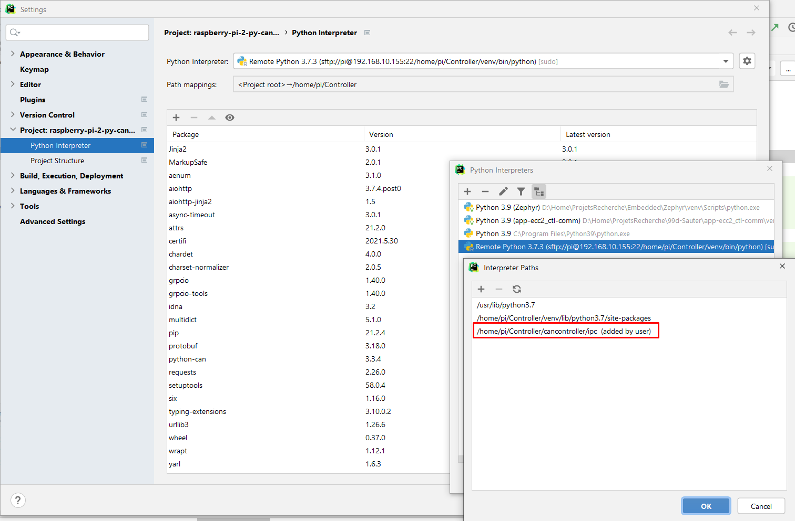

# Python CANIOT Controller

Python `CANIOT` controller :
- grpc 
- aiohttp
- cli
- can

IHM to control garage doors and alarm controller :



Related projects :
- `caniot_common` implementation for AVR ATmega328p : https://github.com/Adecy/caniot-common
- `caniot_garagedoorcontroller` Garage door controller : https://github.com/Adecy/caniot-garagedoorcontroller

I hope there no bugs because I will never review this python garbage again.

---

# Remote Developpement of Python CAN Controller for Raspberry Pi 2

Commands :

Run python script interactively : `/usr/bin/python3 -i /home/pi/Controller/test.py`

# HTTP server

- aiohttp : https://docs.aiohttp.org/en/stable/
  - Quickstart : https://docs.aiohttp.org/en/stable/web_quickstart.html
- flask : https://flask.palletsprojects.com/en/1.1.x/quickstart/

# gRPC

## Command 

Go to virtual env

```
source venv/bin/activate
```

Run proto function
```
python -m grpc_tools.protoc -Icancontroller/ipc --python_out=cancontroller/ipc --grpc_python_out=cancontroller/ipc model.proto
```

# Garage Door Controller API

http://192.168.10.155:8080/garage

# Notes :

- Default values are not showed in proto : https://stackoverflow.com/questions/47373976/why-is-my-protobuf-message-in-python-ignoring-zero-values
- id = 0 will not appear

# Configure remote VENV


# Known issues

## Import of model_pb2

If having this issue :
- https://stackoverflow.com/questions/31843088/isinstance-doesnt-work-when-use-reflection-of-python-protobuf-v2-6-1

You must include the model_pb2 class from the same location, otherwise same class could have several ids.
You have to add the path to the interpreter path like this :



# Deployment

## Add controller and http server to systemd

`sudo ln -s ~/Controller/cancontroller.service /etc/systemd/system/`
`sudo ln -s ~/Controller/canhttpserver.service /etc/systemd/system/`

Check

`ls -l /etc/systemd/system`

Restart services

`sudo systemctl restart cancontroller.service`
`sudo systemctl restart canhttpserver.service`

Check

`systemctl status cancontroller.service`
`systemctl status canhttpserver.service`

Reload systemctl daemon : `systemctl daemon-reload`

Scripts :

`sudo bash scripts/start-services.sh`
`sudo bash scripts/stop-services.sh`
`sudo bash scripts/status-services.sh`